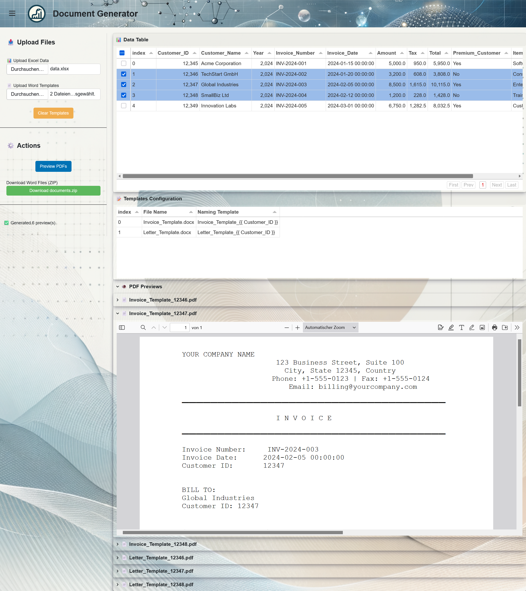
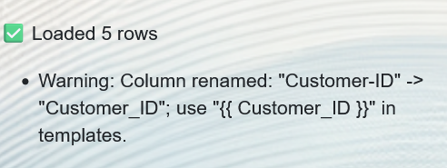

# Document Generator

A Python Panel application for generating personalized documents by merging Excel data with Word templates.

## 📋 Overview

Document Generator allows you to:
- Upload Excel spreadsheets containing your data
- Upload one or more Word document templates
- Select specific rows to process
- Generate personalized Word documents for each selected row and template combination
- Preview generated documents as PDFs
- Download all generated documents as a ZIP file




## 🚀 Quick Start

### Prerequisites

- Python 3.8+
- LibreOffice (for PDF conversion)
- UV package manager (recommended) or pip

### Installation

```bash
# Clone the repository
git clone 
cd document-generator

# Install dependencies
uv sync
# or with pip:
pip install -r requirements.txt
```

### Configuration

Create a `.env` file in the project root:

```env
# Path to LibreOffice executable
LIBREOFFICE_PATH=libreoffice

# PDF conversion timeout in seconds (default: 60)
CONVERSION_TIMEOUT=60
```

### Running the App

```bash
# Using UV (recommended)
uv run panel serve .\src\document-generator\main.py --dev --port 5006 --static-dirs assets=".venv/Lib/site-packages/panelini/assets" --ico-path .venv/Lib/site-packages/panelini/assets/favicon.ico

# Using Python directly
python main.py

# Or with panel serve
panel serve main.py --port 5010 --dev
```

Access the app at: `http://localhost:5010`

## 📖 Usage Guide

### 1. Upload Excel Data

1. Click **"📊 Upload Excel Data"** in the sidebar
2. Select your Excel file (`.xlsx` or `.xls`)
3. The data will be displayed in the **Data Table**
4. Select rows you want to process using the checkboxes

**Excel Requirements:**
- First row should contain column headers
- Column names will be used as template variables

### 2. Upload Word Templates

1. Click **"📄 Upload Word Templates"**
2. Select one or more Word documents (`.docx`)
3. Each template appears in the **Templates Configuration** table
4. Customize the **Naming Template** for output files (optional)

### 3. Configure Naming Templates

In the **Templates Configuration** table, edit the **Naming Template** column to customize output filenames.

**Syntax:**
```
prefix_{{ column_name }}_suffix
```

**Example:**
```
Invoice_{{ Customer_ID }}_{{ Year }}
```

For a row with `Customer_ID=12345` and `Year=2024`, generates:
```
Invoice_12345_2024.docx
```

### 4. Preview Documents

1. Select rows in the **Data Table** (checkboxes)
2. Click **"Preview PDFs"**
3. PDFs appear in the **PDF Previews** section
4. Review before downloading

### 5. Download Documents

1. Select rows to process
2. Click **"Download Word Files (ZIP)"**
3. A ZIP file containing all Word documents will download

## 📝 Word Template Syntax

Document Generator uses [python-docx-template](https://docxtpl.readthedocs.io/) syntax.

### Basic Variable Insertion

In your Word template, use double curly braces:

```
Dear {{ Customer_Name }},

Your invoice number is {{ Invoice_Number }}.
Total: {{ Amount }} EUR
```

### Valid Variable Names

Variable names must not contain spaces or special characters except underscores. 
Column names will automatically be converted to valid variable names by replacing spaces with underscores and removing special characters.
The status message on the left will inform you of any changes made to column names and which names to use in your templates.


### Advanced Features

**Conditional Content:**
```

Thank you for being a premium customer!

```

**Formatting:**
```
Date: {{ Date | date_format }}
Amount: {{ Amount | currency }}
```

**Excel Column Matching:**
- Template variable names must exactly match Excel column names (case-sensitive)
- Spaces in column names are preserved: `{{ First Name }}`
- Leading/trailing whitespace is automatically trimmed


## 🛠️ Technical Details

### Technologies Used

| Component        | Technology                  | Relevant Links                                                                                                            |
|-------------------|-----------------------------|---------------------------------------------------------------------------------------------------------------------------|
| **UI Framework**  | **Panel**                  | [Panel Official Documentation](https://panel.holoviz.org/)                                                                |
| **Template Engine** | **python-docx-template** | [Python-Docx-Template Documentation](https://docxtpl.readthedocs.io/en/latest/)                                           |
| **Excel Parsing**  | **pandas, openpyxl**      | [Pandas Documentation](https://pandas.pydata.org/docs/), [OpenPyXL Documentation](https://openpyxl.readthedocs.io/)       |
| **PDF Conversion** | **LibreOffice (headless)**| [LibreOffice Official Documentation](https://www.libreoffice.org/get-help/documentation/)                                 |
| **App Framework**  | **Panelini**              | [Panelini GitHub Repository](https://github.com/opensemanticworld/panelini)                                               |

### Key Features

- **Batch Processing**: Generate multiple documents in one operation
- **Multi-template Support**: Process multiple templates simultaneously
- **Real-time Preview**: View PDFs before downloading
- **Flexible Naming**: Customize output filenames with template variables
- **Row Selection**: Process only the data you need
- **Error Handling**: Clear error messages and notifications

## ⚙️ Environment Variables

| Variable | Description | Default |
|----------|-------------|---------|
| `LIBREOFFICE_PATH` | Path to LibreOffice executable | `libreoffice` |
| `CONVERSION_TIMEOUT` | PDF conversion timeout (seconds) | `60` |

## 🐛 Troubleshooting

### LibreOffice Not Found

**Error:** `LibreOffice conversion failed`

**Solution:**
1. Install LibreOffice: https://www.libreoffice.org/download/
2. Update `LIBREOFFICE_PATH` in `.env` with the correct path
3. Test manually: `libreoffice --version`

### Template Variables Not Rendering

**Problem:** Variables show as `{{ Variable_Name }}` in output

**Solution:**
- Ensure Excel column names exactly match template variables
- Check for extra spaces in column names
- Variable names are case-sensitive

### PDF Conversion Timeout

**Problem:** PDF preview fails or times out

**Solution:**
- Increase `CONVERSION_TIMEOUT` in `.env`
- Ensure LibreOffice is not running in normal mode
- Check system resources (CPU/memory)

### Excel Upload Fails

**Problem:** Error loading Excel file

**Solution:**
- Ensure file is valid `.xlsx` or `.xls` format
- Check for merged cells (may cause issues)
- Verify first row contains headers

## 🔒 Security Notes

- Uploaded files are processed in temporary directories
- Temporary files are automatically cleaned up
- No data is persisted after session ends
- Run behind authentication in production environments

## 📄 License

This project is licensed under the **Apache License 2.0**.

See the [LICENSE](LICENSE) file for details or visit: https://www.apache.org/licenses/LICENSE-2.0

## 🤝 Contributing

Contributions are welcome! Please:
1. Fork the repository
2. Create a feature branch (`git checkout -b feature/amazing-feature`)
3. Commit your changes (`git commit -m 'Add amazing feature'`)
4. Push to the branch (`git push origin feature/amazing-feature`)
5. Open a Pull Request

Please ensure your code follows the existing style and includes appropriate tests.

## 📧 Support

For questions or issues, please [open an issue](link-to-issues) on GitHub.


